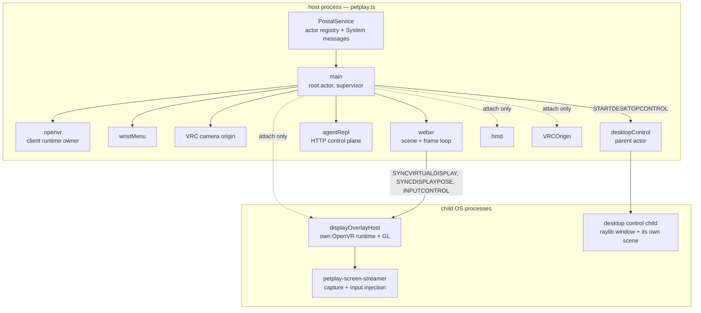
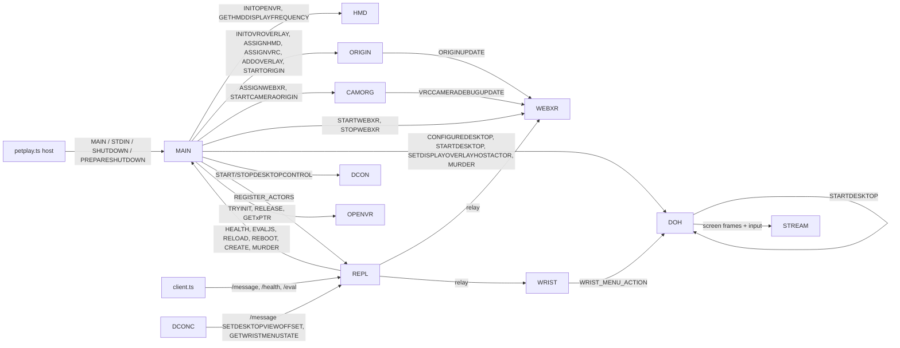
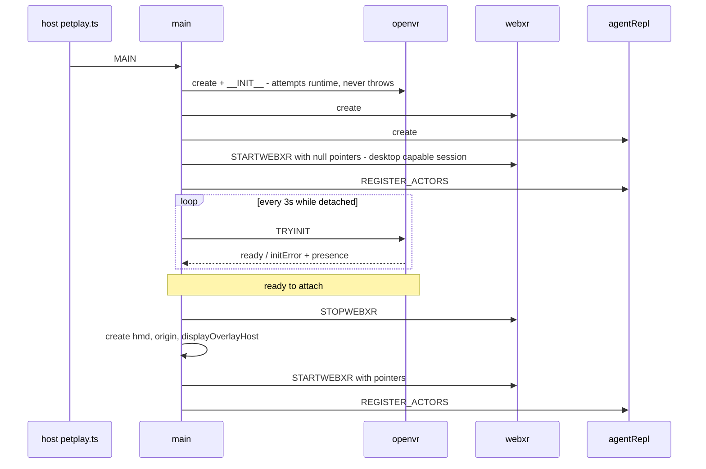
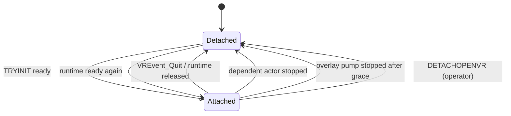
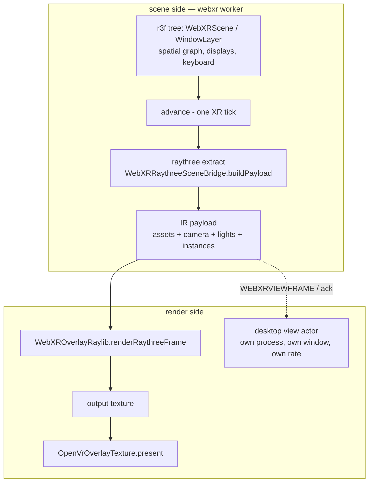
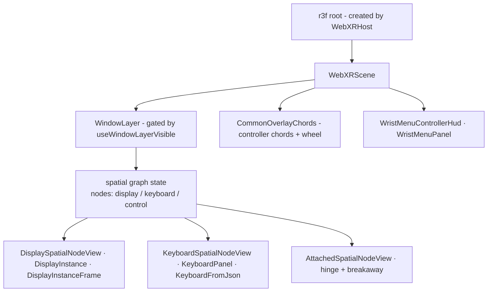

# PetPlay architecture

How the runtime is put together: one long-lived process tree, a stageforge actor graph inside it,
and a hard split between the *scene/update* side and the *render* side. Written against the code as
it stands today; every claim has a `path:line` nearby so it can be re-checked.

Vocabulary used throughout:

| Term | Meaning |
| --- | --- |
| **host** | the entry process (`petplay/petplay.ts`) that owns the `PostalService` actor registry and the only crash hook |
| **actor** | a stageforge message handler running in a Deno worker; it has `state`, an `api` of typed messages, and talks to peers only by posting messages |
| **worker kind** | `Worker` thread inside the host process (default) or `IPCWorker` child OS process (`worker: "process"`) |
| **IR** | raythree's `ExtractionResult` — a self-contained, structured-cloneable render list: assets, camera, lights, instances (`submodules/raythree/src/ir.ts:175`) |
| **attach** | the SteamVR-facing actors existing: `hmd`, `VRCOrigin`, `displayOverlayHost` wired to a live OpenVR client runtime |

## 1. Processes and actors



| Process | Runs | Why it is separate |
| --- | --- | --- |
| host (`petplay/petplay.ts`) | `PostalService`, every thread worker | one registry, one crash hook, one teardown order (`petplay/petplayServer.ts:41-110`) |
| `displayOverlayHost` child | its own `OpenVrRuntime`, GL manager, screen capture | a second OpenVR client runtime plus GL state that must not share the host's (`petplay/main.ts` creates it with `{ worker: "process" }`) |
| desktop control child | raylib window, its own r3f scene, capture HTTP endpoint on 3988 | raylib/GL window ownership; the parent actor only supervises it (`petplay/desktopControlSurface.tsx:174-215`) |
| `petplay-screen-streamer` | portal/WGC capture, injects input | Rust helper; started and restarted by `ScreenCapturer` (`classes/ScreenCapturer/scclass.ts:211-225`) |

A child process is the same program, started two ways. In a checkout the parent runs it through the
Deno CLI (`deno run -A … <script>`); a compiled build has no CLI to run a module with, so it re-execs
its own binary with `--petplay-run-module=<href>` plus the child's arguments and imports the module
out of its embedded snapshot (`classes/childModule.ts`, which also keeps the two forms' argv
identical). `IPCWorker` receives that launcher at boot (`setWorkerChildArgs`,
`petplay/petplayServer.ts:220`), so `{ worker: "process" }` actors take the same path either way — as
does the desktop control child. Everything a child loads by URL has to be embedded as files, which is
why `utils/build.ts` includes `petplay/`, `classes/` and stageforge.

The entry itself is therefore a dispatcher: `petplay/petplay.ts` either runs the dispatched module —
which owns the process from there, event loop and all — or hands control to
`startPetplayServer` in `petplay/petplayServer.ts`. The split is a module boundary rather than an
early exit because a module cannot skip the rest of its own top level.

The OpenVR actors are **threads by necessity**: `hmd`, `VRCOrigin` and `webxr` receive raw OpenVR
interface pointers and build their own vtable wrappers from them, so they must share the host's
address space. Only `openvr` loads the library and calls `VR_InitInternal`
(`classes/openVrRuntime.ts:132-196`).

## 2. Actor catalogue

Live means "created by `main` on some boot path" (verified by sweeping `PostMan.create` call sites).

| Actor | File | Role | Live | Handles |
| --- | --- | --- | --- | --- |
| `main` | `petplay/main.ts` | root; boot, supervision, registry, viewer lifecycle | ✅ | `MAIN`, `STDIN`, `__HEALTH__`, `GETSUPERVISORSTATUS`, `START/STOPDESKTOPCONTROL`, `DESKTOPCONTROLSTATUS`, `DETACHOPENVR`, `PREPARESHUTDOWN` |
| `openvr` | `petplay/OpenVR.ts` | owns the OpenVR client runtime and the raw pointers | ✅ | `TRYINIT`, `RELEASE`, `GETOPENVRPTR`, `GETOVERLAYPTR`, `GETINPUTPTR`, `GETCOMPOSITORPTR`, `GETRENDERMODELSPTR`, `__HEALTH__` |
| `webxr` | `petplay/webxr.ts` | scene, XR session, extraction, overlay submit | ✅ | `STARTWEBXR`, `STOPWEBXR`, `EVALJS`, `SETDESKTOPVIEWOFFSET`, `ORIGINUPDATE`, `VRCCAMERADEBUGUPDATE`, `__SNAPSHOT__`/`__RESTORE__` |
| `wristMenu` | `petplay/wristMenu.ts` | pure state: overlay visibility, tool edit mode | ✅ | `GETWRISTMENUSTATE`, `SETWRISTMENUSTATE`, `TOGGLEWRISTMENUACTION`, `SETDISPLAYOVERLAYHOSTACTOR` |
| `agentRepl` | `petplay/agentRepl.ts` | HTTP control plane over the actor graph | ✅ | `REGISTER_ACTORS`, `GETREGISTRY`, `__SNAPSHOT__`/`__RESTORE__` |
| `displayOverlayHost` | `petplay/displayOverlayHost.ts` | desktop presentation: OpenVR overlays, capture, input injection | ✅ (attached) | `CONFIGUREDESKTOP`, `STARTDESKTOP`, `SYNCVIRTUALDISPLAY`, `REMOVEVIRTUALDISPLAY`, `SYNCDISPLAYPOSE`, `SETOVERLAYLOCATION`, `GETOVERLAYLOCATION`, `SETFRAMEDATA`, `INPUTCONTROL`, `WRIST_MENU_ACTION` |
| `hmd` | `petplay/hmd.ts` | IVRSystem probe: display frequency + a pose websocket | ✅ (attached) | `INITOPENVR`, `GETHMDPOSITION`, `GETHMDDISPLAYFREQUENCY`, `ASSIGNWEB` (no sender), `__HEALTH__` |
| `origin` (`VRCOrigin`) | `petplay/VRCOrigin.ts` | world origin overlay via IVROverlay | ✅ (attached) | `INITOVROVERLAY`, `ASSIGNHMD`, `ASSIGNVRC`, `ADDOVERLAY`, `STARTORIGIN`, `STOPORIGIN`, `GETVRCORIGIN`, `GETOVERLAYLOCATION` |
| `cameraOrigin` | `petplay/VRCOriginCamera.ts` | VRC camera pose producer/consumer; OSC + VRChat-compatible surface | ✅ | `ASSIGNWEBXR`, `STARTCAMERAORIGIN`, `STOPCAMERAORIGIN`, `GETCAMERAPOSE`, `SETUSERCAMERAMODE`, OSC surface |
| `desktopView` | `petplay/desktopView.ts` | decoupled desktop view: a window that renders the scene's IR | on demand | `STARTDESKTOPVIEW`, `STOPDESKTOPVIEW`, `WEBXRVIEWFRAME`, `REQUESTCAPTURE`, `GETCAPTURESTATUS`, `__HEALTH__` |
| `desktopControl` | `petplay/desktopControlSurface.tsx` | interactive desktop surface: mounts its own scene in a child process | on demand | `STARTDESKTOPCONTROL`, `STOPDESKTOPCONTROL`, `__HEALTH__` |
| `genericoverlay` | `petplay/genericoverlay.ts` | ad-hoc overlay from the host's stdin (`spawn <name>`) | on demand | overlay location/stop messages |
| `controllers` | `petplay/controllers.ts` | OpenVR input → webxr (`GETCONTROLLERDATA`, `SETCONTROLLERSHAREDSTATE`) | ❌ dormant (`controllerActor: null`, `petplay/main.ts:501,874`) | — |
| `webxrOverlay` | `petplay/webxrOverlay.ts` | second-process IR consumer: raylib raster + OpenVR present | ❌ dormant (spawner deleted in `f6a5995` "unify rendering more") | `STARTWEBXROVERLAY`, `RENDERWEBXRRAYTHREEFRAME`, `STOPWEBXROVERLAY` |
| `frameUpdater`, `webUpdater`, `webUpdaterDirect`, `frontend` | `petplay/*.ts` | earlier frontend/CEF and frame-pull paths | ❌ no create sites | — |
| `laser`, `OSC` | `petplay/laser.ts`, `petplay/OSC.ts` | overlay lasers, OSC coordinate source | ❌ no create sites | — |

Per-actor internals — the three heavy ones:

| Actor | Within it |
| --- | --- |
| `main` | boot paths (`createSupervisedScene`, `createNoOpenVrScene`), the supervision loop (`superviseOpenVrRuntime`, `attachOpenVrRuntime`, `detachOpenVrRuntime`, `openVrLossReason`), the client surface (`startDesktopView`, `stopDesktopView`, `clientActors`, `clientActorRegistry`), teardown flag (`PREPARESHUTDOWN`) |
| `webxr` | `WebXRHost` (`classes/webxrhost.ts:933`): IWER session, r3f root + `advance()`, pose-only vs WebGPU shim (`XrPoseOnlyManager`, `:614`), controller SAB intake, `captureShadowFrame`, `getRaythreeSceneContext`, desktop view control; the actor adds `initializeOverlay`, the controller loop, the raylib overlay pump, the WebGPU overlay submit, the raylib pacer (`classes/openVrOverlayFramePacing.ts`) and the overlay texture owner (`classes/openVrOverlayTexture.ts`) |
| `displayOverlayHost` | its own `OpenVrRuntime`, `GlManager` (`classes/openglManager.ts`), `ScreenCapturer` + `petplay-screen-streamer`, the `virtualOverlays` map, desktop start retry ladder, and the Linux `INPUTCONTROL` verbs (`M,`/`B,`/`W,`/`C,`/`K,`) that end at uinput |

### Inside `webxr` (code level)

| Concern | Entry points (`petplay/webxr.ts` unless noted) |
| --- | --- |
| scene + XR session | `WebXRHost.start` / `stop`, `enterXrWhenReady`, `startManualXrFrameLoop`, `signalExternalPacerAdvanced`, `patchRendererToXrPoseOnly`, `applyWebGpuXrPoseOnly` (`classes/webxrhost.ts`) |
| poses | `syncIwerEmulatedPosesToSpaces`, `updateEmulatedHeadsetFromOpenVr`, `getCurrentOpenVrHmdPose`, `applyDesktopViewOffsetToOpenVrHmdPose`, `setOpenVrEyeToHeadTransforms`, `applyEmulatedIpdFromHeadset` |
| IR extraction | `getRaythreeSceneContext`, `captureShadowFrame`, `captureOverlayFrame` → `WebXRRaythreeSceneBridge.buildPayload` (`classes/webxrRaythreeScene.ts`) |
| overlay lifecycle | `initializeOverlay`, `ensureRaylibOverlayForFrame`, `ensureWebGpuOverlayForFrame`, `initializeRaylibOpenVrPacer`, `recoverRaylibOverlayTargets`, `stopWebXR` |
| loops | `pumpOverlayFrames` (present), `pumpControllerFrames` (controller SAB), `uploadRaylibShadowFrame`, `uploadWebGpuSceneFrame`, `uploadNativeRaylibDebugFrame` |
| metrics / diagnostics | `recordRaylibOverlayMetrics`, `maybeLogOverlayPerf`, `logFirstOverlayUpload`, `getWebXRStatus`, `evaluateWebXrJs` (the REPL's `EVALJS`) |
| presentation self-heal | `startPresentationWatch`, `repairOverlayVisibility`, `restartRenderingStack`, `dropRaylibOverlayForRecreate`, `handleOverlayFrameFailure`, `getPresentationStatus`; overlay keys via `claimWebXrOverlayKeys` (`classes/webXrOverlayKeyClaim.ts`) |
| desktop view control | `setDesktopViewControlEnabled`, `setDesktopViewOffset`, `isDesktopViewOffsetZero` |

### Inside `displayOverlayHost` (code level)

| Concern | Entry points (`petplay/displayOverlayHost.ts`) |
| --- | --- |
| own OpenVR runtime | `initializeDisplayOverlayOpenVr` (`:322`) / `releaseDisplayOverlayOpenVr` (`:334`), runtime field `:54` |
| GL + capture | `initGl` (`:487`) using `OpenGLManager` (pure GL: `initializePanoramic` GL4.6 + varggles, `initialize2D` GL3.2 offscreen + cursor FBO), `ensureWarmScreenCapturer` (`:470`) / `initScreenCapturer` (`:410`) |
| virtual displays | `virtualOverlays` / `pendingVirtualDisplays` maps (`:100-102`), `SYNCVIRTUALDISPLAY` (`:243`), `REMOVEVIRTUALDISPLAY`, `SYNCDISPLAYPOSE` (`:219`), 250 ms removal grace timers |
| desktop overlay | `CONFIGUREDESKTOP`, `STARTDESKTOP`, the retry ladder (`:56-58`, `:755-823`), stale-key replacement (`:511-527`, `:902-926`) |
| input | `INPUTCONTROL` demux (`:146-152`): `C,` updates the host cursor locally, everything else goes to the capture helper's stdin |

The capture child chain (owned by this actor, never by the host): `ScreenCapturer`
(`classes/ScreenCapturer/scclass.ts:211-225`) spawns a per-instance **Worker** TCP receiver
(`frame_receiver_worker.ts:129-137`) on `127.0.0.1:12345`, then the Rust helper with
`--fps/--port/--capture-token-path` and piped stdin. `ScreenCapturer` surfaces helper exit via
`onExit` (`:233`) and writes control verbs to the helper's stdin (`:262-266`) — it never restarts
anything itself; the display overlay host owns the restart policy.

### Inside `main` (code level)

| Concern | Entry points (`petplay/main.ts`) |
| --- | --- |
| boot | `main`, `createSupervisedScene`, `createNoOpenVrScene`, `startWebXr` (one `STARTWEBXR` shape for both pointer and no-pointer sessions), `desktopOverlayConfig` |
| supervision | `superviseOpenVrRuntime`, `attachOpenVrRuntime`, `detachOpenVrRuntime`, `openVrLossReason`, `waitForActorsStopped`, `readOpenVrPointers` |
| client surface | `clientActors`, `clientActorRegistry`, `registerClientActors`, `startDesktopView`, `stopDesktopView`, `getDesktopViewStatus`, `getSupervisorHealth` |
| plumbing | `callActor` (deadline + `__actorError` unwrap), `actorIsResponsive`, `withTimeout`, `queryOpenVrStatus`, `queryWebXrStatus` |

## 3. Message graph



Actor→actor messages are typed strings; the only transport is
`PostMan.PostMessage({ target, type, payload, reply })`, which is a structured clone. That is why IR
payloads and raw interface pointers (as numbers/bigints) can both cross it, and why `Object3D`
graphs cannot. Note the direction of the two pose edges: the origin and camera-origin actors *push*
into `webxr`; the scene does not poll them. `hmd` also serves a pose websocket on port 8887
(`petplay/hmd.ts:106,116`) that nothing connects to today — the live HMD poses reach the scene
through `WebXRHost`'s own IVRSystem sampling.

The desktop control **child is not an actor**: it reaches the graph through the agent REPL's HTTP
surface (its window process posts `SETDESKTOPVIEWOFFSET` and `GETWRISTMENUSTATE` messages, which the
REPL relays — `petplay/desktopControlSurface.tsx:388-405`,
`classes/environment/wristMenu/logic.tsx:143-199`). Everything else in the graph talks actor to
actor.

## 4. Boot, supervision, teardown

Boot under supervision (`--novr` never creates the OpenVR actors; it takes the `--novr` branch of
the same shape):



Attachment is a state machine, not a one-shot: losing SteamVR tears the VR-facing actors down and
returns to the detached state; getting it back re-attaches on the same process.



Detach order is load-bearing: `STOPWEBXR` (drops overlay, pacer and IVRInput wrappers) →
`SETDISPLAYOVERLAYHOSTACTOR null` + no-runtime `STARTWEBXR` → `MURDER` the dependants → wait until
they stop answering → `openvr.RELEASE` (`VR_ShutdownInternal`). Releasing first, or releasing while
a dependant still holds a wrapper, crashes the process natively — that is why the runtime is the
first actor created and the last torn down (`petplay/main.ts`, `detachOpenVrRuntime`).

Host teardown (`petplay/petplay.ts:32-88`) stops the supervisor first (`PREPARESHUTDOWN`), then
shuts actors down in reverse creation order with a bounded await per actor, so a dead transport
cannot hang Ctrl-C.

## 5. Frame pipeline and rates



| Stage | Cadence | Evidence |
| --- | --- | --- |
| scene update (`advance()`) | one XR tick; in the live config the tick is **edge-triggered by the overlay pump** | `WebXRHost.startManualXrFrameLoop` tick, `signalExternalPacerAdvanced` + `EXTERNAL_PACER_PULSE_MAX_AGE_MS = 100` |
| WebGPU submit | not reachable in raylib-only mode; the host runs the pose-only `XrPoseOnlyManager` and owns no `WebGPURenderer` | `skipWebGpuXrDraw: overlayMode === "raylib"`, `createXrPoseOnlyRenderer` |
| overlay raster + present | one present per OpenVR display frame by default (`raylibMaxFps = 0`), throttled otherwise | `pumpOverlayFrames` branch C, `--webxr-raylib-max-fps`, `OpenVrOverlayFramePacer` vsync wait |
| desktop window | own r3f loop at `SetTargetFPS(60)` | `petplay/raylibR3FViewerApp.tsx:592` |

**Three concurrent loops run in the webxr worker** — and in the live configuration the overlay pump is
the driver:

| Loop | Starts when | Behaviour |
| --- | --- | --- |
| controller pump (`pumpControllerFrames`) | only with `controllerActor` set | idles when a controller SAB is attached, else polls `GETCONTROLLERDATA` every 8 ms; **dormant today** (`controllerActor: null`) |
| raylib overlay pump (`pumpOverlayFrames`) | `hasAnyOverlayMode()` at `STARTWEBXR` | the real frame driver: pace → push OpenVR pose into the host → capture → extract → raster → present → `signalExternalPacerAdvanced()` |
| host IWER rAF tick (`startManualXrFrameLoop`) | with the session | one `advance()` per pulse; `useExternalPacerTiming` makes it early-return unless the pump signalled |

**Pacing** is `OpenVrOverlayFramePacer`: gate 1 is `IVRCompositor.CanRenderScene()` (false → no vsync
wait, HMD pose cache untouched), gate 2 is `GetTimeSinceLastVsync`/frame-index vsync with a
`Prop_DisplayFrequency_Float` fallback path (default 90 Hz) when the call fails. In raylib mode the
**actor** owns the pacer (`raylib-pacer`); the host's own pacer is disabled, which is why
`vsyncDisplayFramesSkipped` stays 0 in that mode.

The live presentation chain, in order (`uploadRaylibShadowFrame`, `petplay/webxr.ts:1339-1499`):
`paceToDisplayAndRefreshPosesYielding` → `applyDirectOpenVrShadowPose` + `updateDirectOpenVrInputs`
(pose **into** the host) → `captureShadowFrame` → `getRaythreeSceneContext` → `buildPayload` (one
`updateMatrixWorld`, one eye extract, right eye aliased) → `renderRaythreeFrame` (two raylib eye
targets, default 3560², combined through the varggles shader) → `setTextureHandle` + `present()`
(`SetOverlayTexture`) → recovery-attempt reset → `signalExternalPacerAdvanced()`.

Two facts this makes precise:

- **Rendering is decoupled from the scene update.** The IR is produced once per XR tick and
  rasterized on the pump's cadence by the in-worker overlay, *and* shipped to any registered view
  (`WEBXRVIEWFRAME`), which rasterizes it in its own process at its own rate — so a VR session and a
  desktop window can show the same scene at the same time with one scene update between them.
- **Two desktop surfaces exist, and only one of them is decoupled.** `desktopView`
  (`petplay/desktopView.ts`) is an IR consumer: a raylib window, `WebXRRaythreeRaylibRenderer`, no
  React tree, no spatial graph — it draws the server's frame and re-draws the latest payload every
  window frame. `desktopControl` (`desktopControlSurface.tsx` child) still mounts its own
  `WebXRScene` (`:104-108`), which is what interactive grabbing in the desktop window needs today;
  it persists its own copy of the spatial graph (see §9).

Delivering IR to a view has one non-obvious step: `ExtractionResult.assets` is a **delta** since the
extractor's previous call, so a view that registers after startup would receive instance lists with
no geometry behind them. The `webxr` actor therefore caches the union of every asset batch it has
published (`rememberViewAssets`) and primes each newly registered view with a full batch
(`viewPrimingPayload`), plus the scene's own background colour (the overlay path keeps its
transparent one so it composites over the real world).

## 6. Control plane

`agentRepl` is an HTTP server (default `127.0.0.1:3987`; `--agent-repl-port`, then
`PETPLAY_AGENT_REPL_PORT`) that resolves actor *names* from the registry `main` publishes:

| Endpoint | Effect |
| --- | --- |
| `GET /health`, `/registry`, `/actors` | registry + `INSPECT` snapshot |
| `GET /health/actor?actor=<name>`, `/health/actors` | per-actor `HEALTH` with a timeout |
| `POST /message {target,type,payload,reply}` | any actor message, awaited when `reply` |
| `POST /eval {target,code}` | `EVALJS` inside that actor's worker |
| `POST /reload {actor}` | `RELOAD`: snapshot → shutdown → recreate same id → restore |
| `POST /reboot`, `/create` | whole-graph reboot, actor creation |

`petplay/client.ts` is the CLI over that surface (`status`, `desktop [--stop]`, `detach-vr`, `dev`),
so shell commands drive the server instead of starting their own scene. Port resolution is shared
through `classes/utils.ts:getAgentReplPort`.

## 7. Render tree inside the webxr worker



**Component list** (`classes/environment/scene.tsx`): `WebXRScene` (`:1432`, picks the OS sinks,
mounts `WindowLayer`), `WindowLayer` (`:455-628`, owns graph/selection/handle stores/workspace
outputs/persistence, returns `null` when the layer is hidden `:599`), `CommonOverlayChords` (`:353`,
joystick push/pull onto the nearest freely grabbed handle, joystick hinge rotation onto the nearest
constrained one, + wheel scroll over display ray-hit surfaces),
`SpatialNodeView` dispatch (`:754`), `DisplaySpatialNodeView` (`:768`), `KeyboardSpatialNodeView`
(`:966`), `SpatialAttachmentView` (memo wrapper so an attached keyboard's 74 caps are not rebuilt,
`:1101`), `AttachedSpatialNodeView` (`:1111`, hinge clamp + breakaway at `0.22 m` VR /
`180 px` desktop), `SpatialControlView` (`:1339`, dead — see §9), `SpatialAudioProvider`,
`DisplayInstance` (`displayInstance/logic.tsx:73`), `KeyboardPanel` (`keyboard/keyboard.tsx:54`),
`GrabBox` (`grabbox.tsx:87`, the only grab initiator).

**Spatial state** is a normalized graph, not JSX: `SpatialGraph = {nodes, hitboxes, …}` with
`display` / `keyboard` / `control` nodes (`classes/environment/spatialGraph.ts:45-95`), created by
`createInitialSpatialGraph` (`:176`), mutated only through pure functions (`commitNodeTransform`,
`attachSpatialNodeToSlot`, `releaseHinge`, `detachFromParent`, `deleteSpatialNode`, …), held in one
`useState` inside `WindowLayer` (`scene.tsx:482`) and threaded down as props.

**Persistence**: `spatialLayoutPersistence.ts` — versioned envelope `{version:1, graph}` with a full
structural validator (ids/kinds/transforms/hinges/hitboxes/cycles), sync load via
`loadSpatialLayoutSync`, atomic `tmp + rename` save on every graph change, path
`PETPLAY_SPATIAL_LAYOUT_PATH` or `$XDG_CONFIG_HOME/petplay/spatial-layout.json`. A bad file returns
`null` and the scene falls back to the initial graph. `spatialLayoutPersistenceEnabled()` is
`--desktop-control-child || !--desktop`, so the XR host and the desktop-control child each persist
their **own** copy of the graph — see §9.

**Layer gate**: `windowLayerMode.ts` keeps a module flag seeded from `--dev-start-desktop-overlay`
and toggled by the wrist menu's layout button (`wristMenu/logic.tsx:239-253`) — that toggle is the
only producer, and hiding the layer removes the whole spatial tree including its adapter jobs.

**Sync to the overlay host**: `DisplayInstance` runs a `phase: "finish"` frame job (enabled only
when a host actor is set, and only for a display whose workspace output is connected —
`scene.tsx:815`) that sends `SYNCVIRTUALDISPLAY {id, name, crop, hmd, widthMeters}` or
`SYNCDISPLAYPOSE {hmd, widthMeters}` (`displayInstance/logic.tsx:198-212`), and
`REMOVEVIRTUALDISPLAY` on unmount. Pose is rigid (unit scale) and physical size travels only through
`SetOverlayWidthInMeters`. Inbound, everything goes the other way as `INPUTCONTROL` command strings
(`scene.tsx:118-123`): `C,x,y` for the compositor cursor, `M,`/`B,`/`W,` for pointer movement,
buttons and wheel, and `K,<scanHex>,<down>` for keys — written to the capture helper's stdin.

**Keyboard**: `KeyboardPanel` reads `resources/Keyboard.json` for geometry and resolves each
unlabelled cell's legend from the locale table (`us` / `fi`), with the locale defaulting to the
host's own keyboard layout (`localectl` → `X11 Layout`, then `--keyboard-locale` /
`PETPLAY_KEYBOARD_LOCALE` override, then `us`); `deno task status` reports the active id and source.
Key events leave the scene through the sink chosen per OS (below).

Every row renders in a **fixed one-row band** (`KeyboardRowView` sets `height={rowH}`), because the
row set is not uniform: an ISO or JIS Enter is one cell with `height: 2.055` (row units), and the row
it sits in carries a spacer (`SP(1.3)`) where its lower half lands. A tall key therefore *spills*
into the next band instead of stretching its own row — stretching was the bug: each following row
was pushed down by the overhang, the board grew past the AABB that `keyboardContentBoundsUnits`
computes for the panel and grab box, and the right-hand end of the board showed a black notch with
the selection outline left floating beside it.

Layout modes (`KeyboardLayoutMode`, default `arrows`, overridable with
`PETPLAY_KEYBOARD_LAYOUT_MODE`): `compact` is the main block alone, `arrows` adds the nav group's
arrow cluster — the rows above it become spacers so it lines up with the bottom of the board, as a
physical nav cluster does — and `full` adds the whole nav block and numpad. UI and
`keyboardContentBoundsUnits` both go through `keyboardColumns`, so the grab box can never describe a
board other than the one drawn.

Typing behaviour:

- **Sticky modifiers are one-shot.** Shift/Ctrl/Alt/Meta latch on press (the caps light up like a
  held modifier) and release with the next key, so a chord does not leave the modifier held; Caps
  Lock is a `toggle` cell and stays latched. The release is emitted as `modifier {active: false}` for
  every latched modifier the key consumed, so the OS sink drops them too.
- **Hold to repeat.** A cap starts auto-repeating after 420 ms and then every 45 ms while the pointer
  stays on it (`KEY_REPEAT_DELAY_MS` / `KEY_REPEAT_INTERVAL_MS` in `keyboardKeyInteraction.tsx`).
  Modifier and toggle cells never repeat — they latch instead.
- **No dead space between caps.** Rows are laid out with explicit `keyPadding` gap containers, which
  used to be unpickable holes: a ray snapping between two keys typed nothing. Horizontal gaps now
  activate the key that follows them and row gaps activate the first key of the row they sit above,
  so every ray that lands on the board hits a key.

The keyboard's own box is drawn magenta (`KEYBOARD_GRABBOX_LINE_COLOR`) so it never reads as one of
the display boxes' blue ones, and `KeyboardPanel` adds the same **depth-only occluder** a display's
screen surface uses: a `colorWrite: false`, `depthWrite` plane across the board, drawn first
(`renderOrder -100`) and not pickable. Chrome and geometry depth-tested behind the board — including
the grab box's own rear bars, so the box reads as a frame around the board rather than a wireframe
cube — fail against it, while everything in front stays visible. The wrist menu's panel
(`wristMenu/logic.tsx`, 0.528 m square) gets the same plane.

Two things to know before adding one elsewhere:

- **The occluder must sit outside any `bridge: { kind: "skip" }` subtree.** `isBridgeSkipped` walks
  *ancestors*, so that flag removes a whole subtree from the raylib IR — the wrist menu's visuals
  travel in the uikit payload instead, and an occluder nested inside its skipped group never reaches
  the overlay. Hence the panel's occluder is a sibling of the skipped group, sharing its transform.
- **The uikit pass ignores depth** (it draws with depth test off), so an occluder only hides
  instance/chrome geometry, not other panels.

**Input sinks** (chosen once in `WebXRScene:1441-1454`):

| Platform | Pointer | Keyboard |
| --- | --- | --- |
| Linux with an overlay host | `createLinuxMouseSink` → smoothed uinput path (`scene.tsx:156`) | `createLinuxKeyboardSink` → `K,<scanHex>,1/0` (`scene.tsx:175`) |
| otherwise | `windowsSystemDisplayMouseSink` (`SendInput`) | `windowsSystemKeyboardSink` (`SendInput`, scan-code first, VK fallback `keyboard/win32SystemKeyboard.ts:163`) |

**Viewer entrypoints** that mount `runRaylibR3FViewerApp` (`petplay/raylibR3FViewerApp.tsx`: window +
raylib + DOM/pointer shims + r3f extraction + orbit helpers + capture endpoint): `uiViewer.tsx`
(`deno task ui`), `keyboardViewer.tsx` (`deno task keyb`), and the desktop-control child, which is
the only one that mounts the **full `WebXRScene`** (`desktopControlSurface.tsx:104-108`) alongside
`DesktopViewOffsetBridge` and a head-locked `DesktopWristMenuHud`.

## 8. Reading the live graph

Everything in §3–§7 is inspectable while a server runs (default port 3987; use
`--agent-repl-port=<n>` / `PETPLAY_AGENT_REPL_PORT` to move it):

```bash
curl -s http://127.0.0.1:3987/health/actors                       # HEALTH of every registered actor
curl -s "http://127.0.0.1:3987/health/actor?actor=main"           # supervisor phase, attaches, lastReason
curl -s "http://127.0.0.1:3987/health/actor?actor=webxr"          # frames, xr/overlay fps, raylib readiness
deno task status                                                  # the same readout, formatted
```

`POST /eval {target:"webxr"}` runs inside the scene worker, which is how the render tree and the
keyboard can be inspected against a live session — for example traversing the r3f scene for the
keyboard node and reading its rendered legend meshes, or switching the keyboard locale with
`setKeyboardLocale` from `classes/environment/keyboard/keyboardLocale.ts`. `POST /reload {actor}`
snapshots, restarts and restores one actor in place (the registry survives); `POST /message` is the
generic path, e.g. `{"target":"main","type":"DETACHOPENVR","reply":true}` for the ordered SteamVR
detach.

## 9. Known gaps

Findings from writing this doc, all traceable to code:

- **Lowered line geometry never reaches the screen in the overlay**: a `lineSegments`
  (raythree `bridge`) is extracted into the IR, its tube geometry uploads, and `drawHudOverUiInstances`
  issues the `DrawMesh` — and no pixels appear, in the headset or in a capture (both are the same
  raylib path). Confirmed with single-frame controls: a magenta box *mesh* with `raythreeHudOverUi`
  draws, the same box as line geometry does not, and an over-UI debug draw line
  (`--webxr-raythree-debug=1`) shows the tube geometry being drawn as `indices=yes` with nothing on
  screen. Grab-box chrome no longer depends on it — it is twelve thin **mesh** bars
  (`grabbox.tsx`, `GrabBoxFrame`) — but any other consumer of `bridge` lines (controller beams are
  already meshes) would be invisible in the overlay while being visible on the WebGPU surface.
- **Two desktop surfaces** (see §5): `desktopView` is decoupled (IR consumer, one window process,
  no scene); `desktopControl` still mounts a second `WebXRScene` and is the one that can grab, which
  also means it holds a second spatial graph and persists it to the same `spatial-layout.json` — no
  watcher on either side, so concurrent edits diverge until a restart.
- **Only the rendering pose is offsettable, so only surfaces that own the whole viewpoint may move
  it**: `SETDESKTOPVIEWOFFSET` shifts the pose the scene renders from, while `displayOverlayHost`
  places its mirror overlays in absolute OpenVR space. Any surface that pans/dollies therefore
  desyncs the two frames unless it also moves the overlays. The decoupled preview does not ask for
  that control any more (it registered `cameraControl: true` and forwarded wheel/drag); the legacy
  control surface grants it through its own `STARTWEBXR` payload. A capture taken from the preview
  is *exactly* what the headset is being shown (`client capture`), so a frame where scene content and
  the monitor mirrors disagree is a real desync, not a capture artifact.
- **Captures render the preview, not the eye targets**: the eye render targets hold the varggles
  panoramas the combine pass re-projects (each is internally flipped, and each carries both eyes),
  so reading one gives a distorted panorama rather than a view. `client capture` goes through the
  preview renderer's own framebuffer instead, which is a plain screen readback.
- **Multi-instance collisions beyond overlay keys**: two instances on one machine still fight over
  fixed ports — the `hmd` pose websocket (8887) and the capture receiver (12345) both fail with
  `Address already in use` in the second instance. Overlay keys are claimed per process now; these
  ports are the remaining fixed resources (env/pid-derived ports would fix them the same way).
- **Desktop view fidelity is angular-resolution bound**: the headset rasterizes each eye at 3560²
  over the same FOV the window draws into 1280×720, so UI text that is legible in VR is a few pixels
  tall in the window. Supersampling the view or dollying closer are the workarounds; interaction
  (grabbing from the desktop window) does not exist in the IR-consumer surface yet.
- **Dormant actors are dead weight** (no `PostMan.create` call site anywhere):
  `webxrOverlay` (the split-process IR consumer, superseded in `f6a5995`), `frameUpdater`
  (hard-coded Windows helper path `./resources/screen-streamer.exe`), `webUpdater` (frames arrive
  over the Windows named pipe `\\.\pipe\petplay-webxr` via `classes/CefCap`), `webUpdaterDirect`
  (spawns `chromedirect_demo` from a submodule that is absent from the tree and `.gitmodules`),
  `controllers`, `laser`, `OSC`, `frontend`. `frameUpdater` and `webUpdater` even share the actor
  name `updater`.
- **Unreachable or unwired code**: `control` spatial nodes are deleted by
  `reconcileDisplayControls` (`spatialGraph.ts:459-465`) at the tail of every graph-producing
  function and `addControl` has no callers, so `SpatialControlView` cannot appear;
  `classes/environment/spatialHitbox.tsx` has no importers; `RoomWireBox` is commented out of the
  tree; the keyboard `latestControllerData` intake (`WebXRHost.setControllerData`) is written and
  never read; `patchRendererToXrPoseOnly` appears unreachable from `start()` (inference from the
  mutual guard at `webxrhost.ts:1132`/`:1254`).
- **Capture receiver has no reconnect**: `frame_receiver_worker` posts `disconnected` on TCP loss
  and `ScreenCapturer` does not handle it, so a helper restart is only noticed through `onExit`.
- **Shutdown is signal-shape sensitive**: a single-process SIGTERM shuts down cleanly; a
  process-group SIGTERM kills the capture helper and overlay children mid-flight, which the parent
  cannot tear down gracefully.
- **Snapshots only cover `RELOAD`**, not `REBOOT`, and most actors have no `__SNAPSHOT__` at all.
- **Native aborts are outside JS control**: a segfault in a thread worker takes the process with it;
  `utils/dev-runner.ts` exists to keep the log from such a crash.
